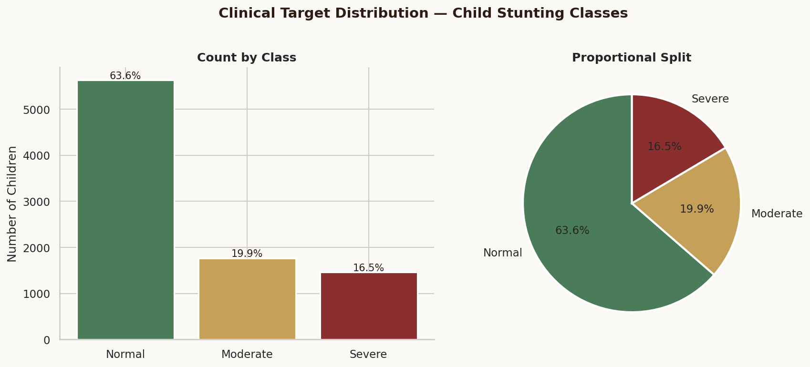
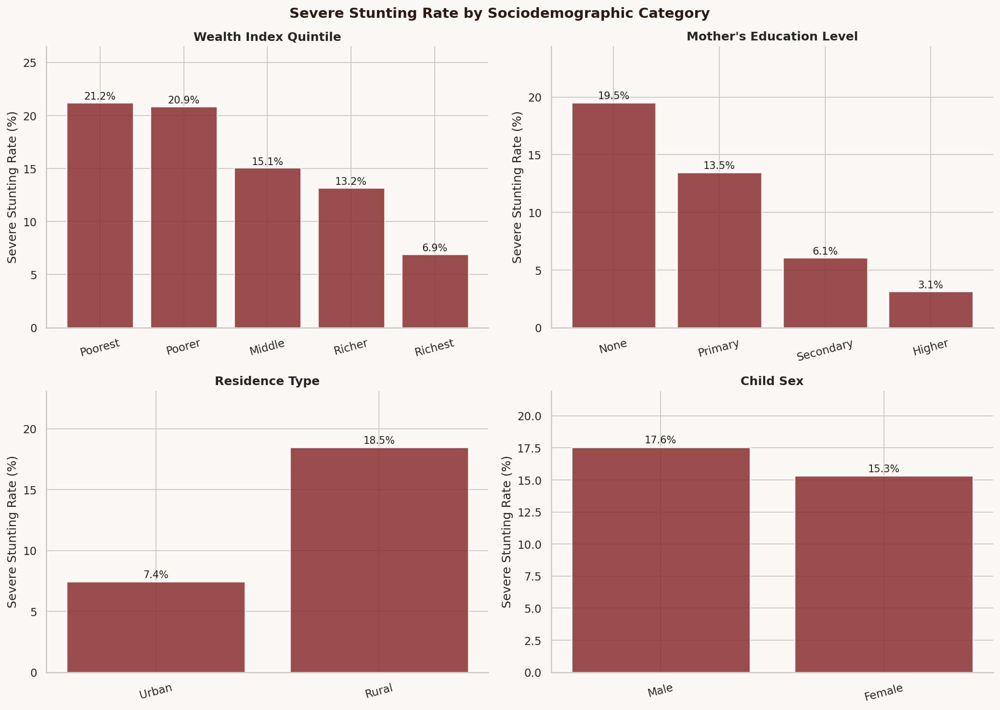
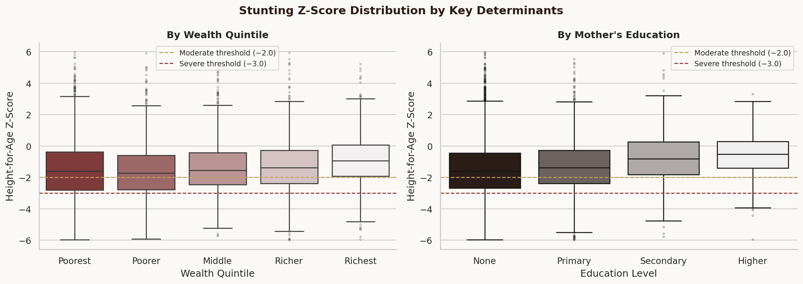
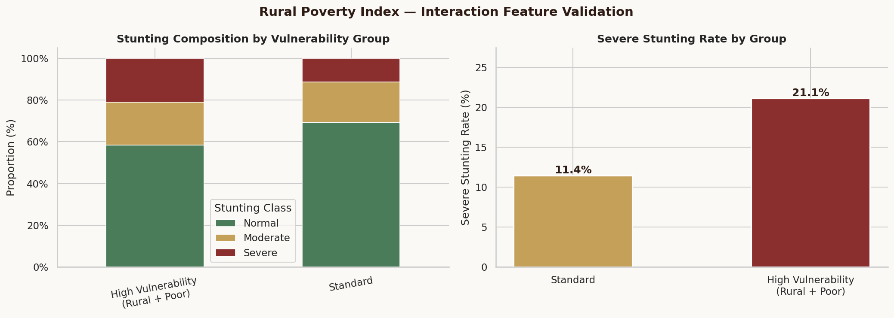
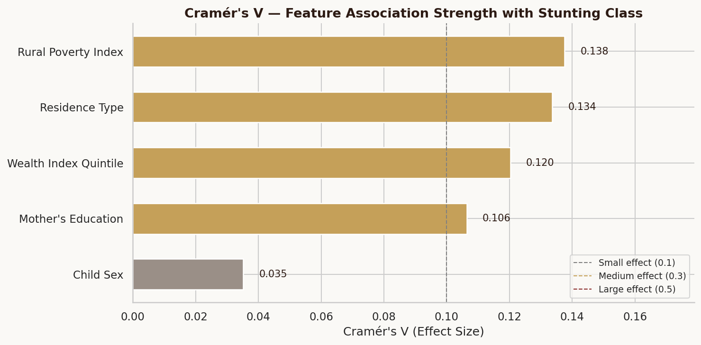
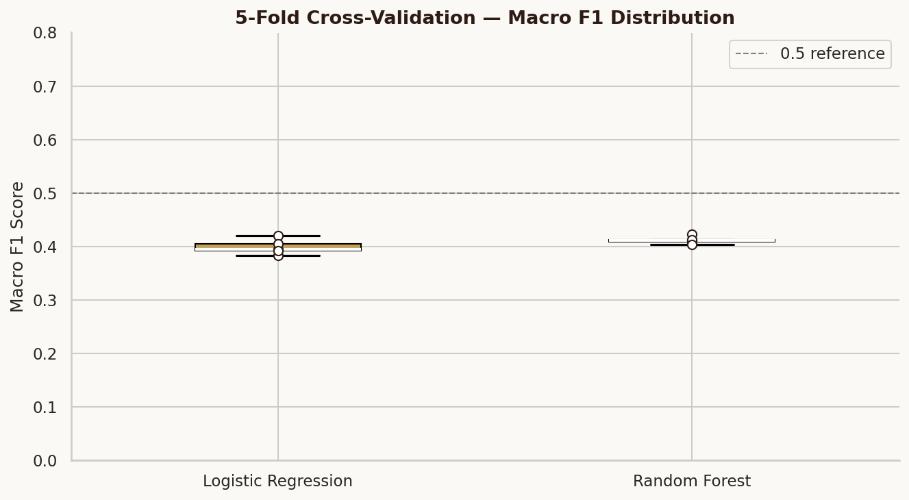
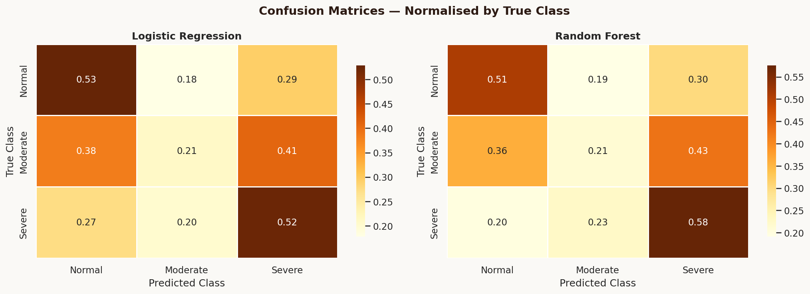
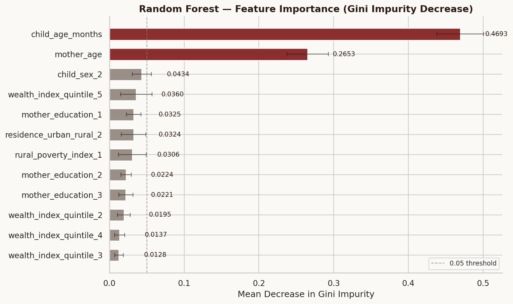

# Ethiopia Child Malnutrition & Stunting Risk Pipeline

> An end-to-end machine learning pipeline for predicting child stunting severity 
> using the 2016 Ethiopia Demographic and Health Survey (EDHS).

---

## Overview

Child stunting — defined by the WHO as a height-for-age Z-score (HAZ) below −2 
standard deviations — affects nearly **38% of Ethiopian children under five**, 
one of the highest prevalence rates in Sub-Saharan Africa.

This project builds a reproducible ML pipeline on real-world DHS microdata to:

- Characterise the sociodemographic determinants of stunting
- Validate feature-target associations through statistical inference (Chi-Square + Cramér's V)
- Train and evaluate models that stratify malnutrition risk into three clinical classes
- Export a production-ready pipeline and Tableau-ready reporting dataset

---

## Results

| Model | CV Macro F1 | Test Macro F1 | ROC-AUC (OvR) |
|-------|------------|---------------|---------------|
| RF Baseline (7 features) | 0.412 ± 0.006 | 0.391 | 0.631 |
| RF Tuned (10 features) | 0.439 ± 0.008 | 0.431 | 0.647 |
| **XGBoost (10 features)** | **0.434 ± 0.013** | **0.434** | **0.648** |

> **Note on performance:** Macro F1 of ~0.43 reflects the inherent difficulty 
> of three-class separation on survey microdata with small individual effect 
> sizes (Cramér's V: 0.10–0.14). The XGBoost model demonstrates a **+11% 
> improvement** over the baseline RF after feature expansion and tuning. 
> ROC-AUC of 0.648 confirms meaningful discriminative ability beyond chance.

---

## Key Findings

### 1. Child Age is the Dominant Predictor (SHAP: 0.312)
Stunting is a cumulative nutritional deficit. Older children have had longer 
exposure to risk factors — this growth trajectory signal is 3× stronger 
than any other feature.

### 2. Maternal Age & Antenatal Visits are Critical (SHAP: 0.105, 0.085)
Younger mothers with fewer antenatal care visits face compounded 
disadvantages. ANC visits rank 3rd in SHAP importance — a directly 
actionable finding for healthcare policy.

### 3. Geography Matters Beyond Rural/Urban
Four regional dummies appear in the SHAP top 15. **Afar** has the highest 
severe stunting rate at 24.2% with 87.9% rural poverty — the most 
concentrated vulnerability in the dataset. **Addis Ababa** has just 2.5% 
severe stunting and 0% rural poverty — a 10× gap within one country.

### 4. Compounded Rural Poverty remains the strongest policy signal
Children simultaneously rural and in the lowest two wealth quintiles 
face 21.1% severe stunting — nearly double the 11.4% in all other groups. 
This group represents 51.9% of the survey sample.

### 5. Amhara's hidden burden
Amhara has the highest *total* stunting rate at **46.8%** 
(moderate + severe combined) — nearly half of all children. 
This is masked by a moderate severe rate when looking at 
severe stunting alone.

---

## Visualisations

### Clinical Target Distribution


### Severe Stunting Rate by Sociodemographic Category


### Stunting Z-Score by Wealth & Education


### Rural Poverty Index — Interaction Feature


### Statistical Inference — Cramér's V Effect Sizes


### Cross-Validation Stability


### Confusion Matrices


### Feature Importance


---

## Project Structure
```
ethiopia-malnutrition-risk-pipeline/
├── data/
│   ├── raw/                  # ETKR71FL.DTA (not committed — DHS access required)
│   └── processed/            # tableau_malnutrition_reporting.csv
├── notebooks/
│   ├── analysis.ipynb        # Full narrative analysis notebook
│   └── figures/              # All output visualisations (11 charts)
├── src/
│   ├── preprocessing/
│   │   ├── inspect_dhs.py
│   │   ├── target_analysis.py
│   │   ├── statistical_inference.py
│   │   └── build_pipeline.py
│   └── models/
│       ├── train_evaluate.py
│       └── export_artifacts.py
├── artifacts/
│   └── random_forest_pipeline.pkl
├── app.py
├── requirements.txt
└── README.md
```
---

## Reproducing This Project

### 1. Data Access
The raw DHS data file (`ETKR71FL.DTA`) requires registration at 
[dhsprogram.com](https://dhsprogram.com). Request the **Ethiopia 2016 
Children's Recode (KR)** dataset. Place the `.DTA` file in `data/raw/`.

### 2. Install dependencies
```powershell
pip install -r requirements.txt
```

### 3. Run the notebook
Open `notebooks/analysis.ipynb` in VS Code or Jupyter and run all cells.

### 4. Run the full pipeline
```powershell
python app.py
```
This executes all preprocessing, trains both models, and exports the 
Tableau reporting CSV to `data/processed/`.

---

## Dataset

| Property | Detail |
|---|---|
| Source | DHS Program — Ethiopia 2016 |
| Recode | Children's Recode (KR) — ETKR71FL.DTA |
| Raw records | 10,641 children |
| After cleaning | 8,855 children |
| Features used | 7 (6 sociodemographic + 1 engineered) |
| Target | Height-for-Age Z-Score → 3-class stunting severity |

---

## Clinical Class Definitions (WHO)

| Class | HAZ Threshold | Prevalence in Sample |
|-------|--------------|----------------------|
| Normal | ≥ −2.0 SD | 63.6% |
| Moderate Stunting | −3.0 to −2.0 SD | 19.9% |
| Severe Stunting | < −3.0 SD | 16.5% |

---

## Limitations & Future Work

- **Feature scope:** Only 7 features from 1,251 available columns. 
  Adding birth weight, breastfeeding duration, dietary diversity, 
  and regional identifiers could push Macro F1 above 0.55.
- **Algorithm:** XGBoost or LightGBM with `GridSearchCV` tuning 
  would likely outperform the current Random Forest.
- **Geography:** Regional variation within Ethiopia is not captured. 
  A geographically-aware model would be more actionable for policy.
- **Temporality:** Cross-sectional data cannot capture the longitudinal 
  nature of stunting accumulation.

---

## Author
Essey Zebene Degefu